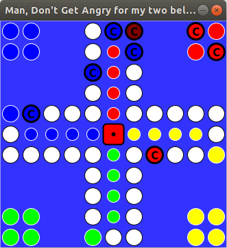

# Bibi Man, Don't Get Angry
A simple Man, Don't Get Angry version for my two beloved little ones (Bibis).

It's implemented in C using Gtk+ and libcanberra for playing sounds.

A primitve computer enemy and record/play (store/load) functionality is implemented.

Here's a screenshot on how it looks so far:

